# Answers

### Question No-1

`1. Write an SQL query to retrieve the names and emails of all customers.
`

```sql
select FirstName,LastName,Email
from customers
```


### Question No-2

`2. Write an SQL query to list all orders with their order dates and corresponding customer names.
`

```sql
select OrderDate, c.FirstName,c.LastName
from orders o
join customers c on o.CustomerID = c.CustomerID
```

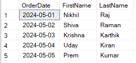

### Question No-3

`3. Write an SQL query to insert a new customer record into the "Customers" table. Include customer information such as name, email, and address.
`

```sql
insert into customers values (6,'Rithwik','Raj','rr@gmail.com',67890,'Madinaguda')
```

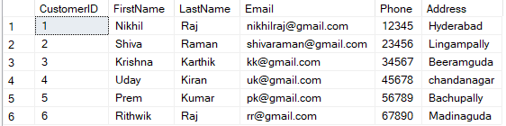

### Question No-4

`4. Write an SQL query to update the prices of all electronic gadgets in the "Products" table by increasing them by 10%.
`

```sql
update products
set price = Price * 1.1
where ProductName IN ('Phone','Laptop','Tablet','SmartWatch','EarBuds')
```

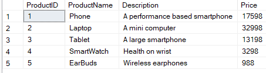

### Question No-5

`
5. Write an SQL query to delete a specific order and its associated order details from the "Orders" and "OrderDetails" tables. Allow users to input the order ID as a parameter.`

```sql
delete from orderdetails where OrderID = 1
delete from orders where OrderID = 1
```

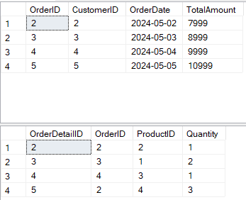

### Question No-6

`6. Write an SQL query to insert a new order into the "Orders" table. Include the customer ID, order date, and any other necessary information.
`

```sql
insert into orders values (6,2,'2024-02-06',6999)
```

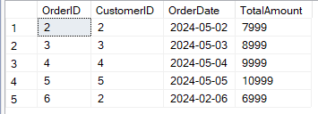

### Question No-7

`
7. Write an SQL query to update the contact information (e.g., email and address) of a specific customer in the "Customers" table. Allow users to input the customer ID and new contact information.`

```sql
update customers
set Email = 'nr@gmail.com' , Address = 'London'
where CustomerID = 1
```

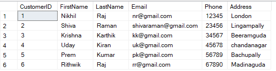

### Question No-8

`8. Write an SQL query to recalculate and update the total cost of each order in the "Orders" table based on the prices and quantities in the "OrderDetails" table.
`

```sql
update orders
set TotalAmount = (
select sum(od.Quantity * p.Price)
from orderdetails od
join products p on od.ProductID = p.ProductID
where od.OrderID = orders.OrderID
)
```

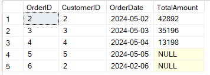

### QUestion No-9

`9. Write an SQL query to delete all orders and their associated order details for a specific customer from the "Orders" and "OrderDetails" tables. Allow users to input the customer ID as a parameter.
`

```sql
delete from orderdetails where OrderID in (select OrderID from orders where CustomerID = 5)
delete from orders where CustomerID = 5
```

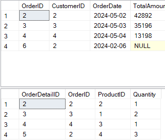

### Question No-10

`10. Write an SQL query to insert a new electronic gadget product into the "Products" table, including product name, category, price, and any other relevant details.
`

```sql
insert into products values (6,'Pendrive','Portable data storage device',1299)
```

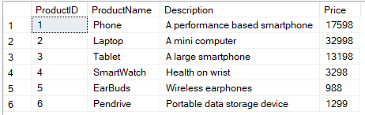

### Question No-11

`11. Write an SQL query to update the status of a specific order in the "Orders" table (e.g., from "Pending" to "Shipped"). Allow users to input the order ID and the new status.`

`Note : There is no column of status in Orders Table. So, I've done the update operation on OrderDate Column`

```sql
update orders
set OrderDate = '2024-05-06'
where OrderID = 6
```


### Question No-12

`12. Write an SQL query to calculate and update the number of orders placed by each customer in the "Customers" table based on the data in the "Orders" table.
`

```sql
alter table customers
add orderCount int

update customers
set orderCount  = (
select COUNT(*)
from orders
where orders.CustomerID = customers.CustomerID
)
```


### Question No-13

`13. Write an SQL query to retrieve a list of all orders along with customer information (e.g., customer name) for each order.
`

```sql
select orders.OrderID,customers.CustomerID,customers.FirstName, customers.LastName,customers.Email
from orders
join customers on customers.CustomerID = orders.CustomerID
```

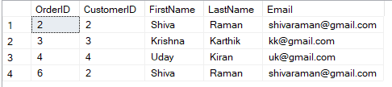

### Question No-14

`14. Write an SQL query to find the total revenue generated by each electronic gadget product. Include the product name and the total revenue.
`

```sql
select products.ProductName, sum(orderdetails.Quantity * products.Price) as TotalRevenue
from orderdetails
join products on orderdetails.ProductID = products.ProductID
group by products.ProductName
```

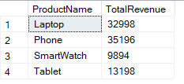
